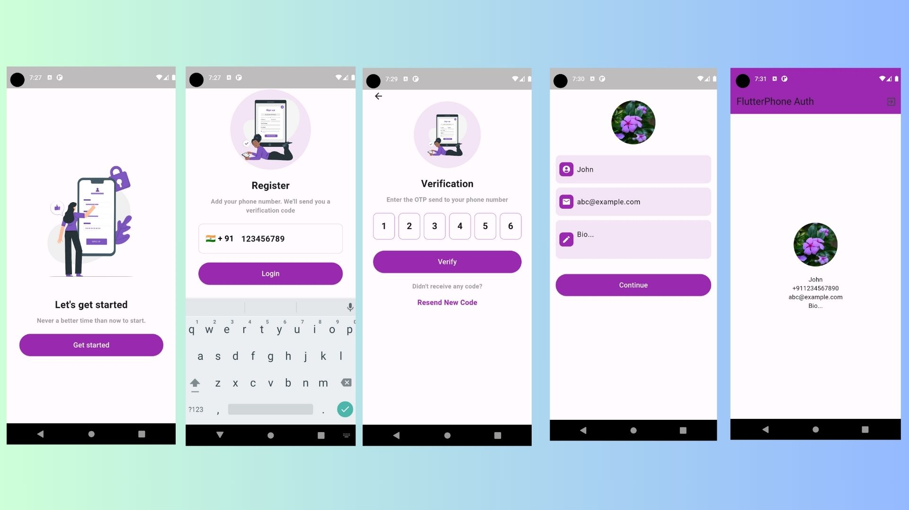

# PhoneAuth_Firebase

This Flutter application incorporates Firebase authentication and allows users to create and view basic user profiles.

## Features

### Authentication:
- Firebase authentication using phone number and OTP.
- User registration and login with email and password.
- State management using Provider.

### User Profile:
- Profile creation screen upon successful authentication.
- Basic user profile form with fields for name, email, and profile picture.
- State management using Provider for user profile data.
- Profile information stored in Firebase Firestore.

### Navigation:
- Navigation between authentication screens (login, registration) and profile creation screen.
- Proper handling of navigation stacks for back navigation.

## UI/UX:
- Clean and intuitive layout design.
- Error handling and user feedback during authentication and profile creation.

### Sreenshot



## Getting Started
1. Clone this repository to your local machine:

   ```bash
   git clone https://github.com/your_username/your_project.git

2. Set up Firebase for your project:
- Create a new project in the Firebase Console.
- Follow the instructions to add your Flutter app to the Firebase project.
- Enable Firebase Authentication and Firestore for your project.
- Download the google-services.json file and place it in the android/app directory for Android, or the GoogleService-Info.plist file 
and place it in the ios/Runner directory for iOS.

3. Install dependencies by running the following command in your project directory:

    ```bash
    flutter pub get
4. Run the app on a connected device or emulator:
    ```bash
    flutter run

5. Folder Structure
- lib/: Contains the Dart code for the Flutter project.
- screens/: Contains UI screens for authentication, profile creation, and profile viewing.
- providers/: Contains state management classes using Provider package.
- services/: Contains service classes for interacting with Firebase and other external services.
- model/: contains the user model